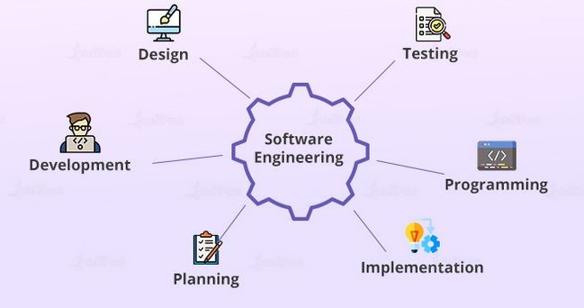

Beyond Web Development: A Journey into Fundamental Software Engineering Concepts

## Introduction

Throughout this course, my exploration of software engineering has ventured beyond just web application development. While acquiring valuable skills in crafting web applications, the more profound goal has been to delve into fundamental software engineering concepts themselves. This essay reflects on my learnings from three pivotal topics—Development Environments, Coding Standards, and Agile Project Management—and considers their broader implications in the diverse landscape of software engineering.

## Development Environments

Development environments serve as the bedrock of software creation, providing a tailored space for developers to design, code, and test their applications. Beyond web development, the significance of development environments lies in their universality across various software domains. Whether developing desktop applications, mobile apps, or embedded systems, the principles of a well-configured development environment remain consistent.

In essence, a development environment encapsulates tools, libraries, and configurations that streamline the development process. The principles of version control, integrated testing, and collaborative features inherent in these environments are equally applicable in non-web contexts. For instance, in embedded systems development, a robust development environment ensures seamless integration with hardware components and accelerates the iterative process of debugging and testing.

## Coding Standards

Coding standards, while crucial in the context of web applications, extend their impact into diverse software projects. These standards, governing aspects such as naming conventions, indentation, and documentation, foster code readability and maintainability. Beyond web development, adherence to coding standards becomes a linchpin in collaborative software engineering efforts.

Consider a scenario involving the development of a machine learning algorithm for data analysis. In this context, well-defined coding standards not only enhance the comprehensibility of the codebase but also contribute to the reliability and scalability of the algorithm. A consistent approach to coding standards facilitates collaboration among interdisciplinary teams, promoting a shared understanding of the code and easing the integration of algorithmic components into a broader software ecosystem.

## Agile Project Management

Agile Project Management, with its iterative and adaptive approach, is often perceived as synonymous with web development. However, its principles extend far beyond this niche, finding application in a myriad of software engineering projects. Issue Driven Project Management, a style of Agile Project Management, particularly underscores its versatility in diverse project contexts.

In the development of a desktop application, for instance, Issue Driven Project Management provides a structured framework for handling evolving requirements and incorporating user feedback. The iterative cycles inherent in this approach align with the need for incremental enhancements and continuous improvement in software projects across various domains. The emphasis on collaboration, customer satisfaction, and responsiveness to change, inherent in Agile methodologies, proves invaluable in non-web software engineering endeavors.

## Conclusion

This course has been a journey into the heart of software engineering, where the acquisition of web development skills served as a gateway to understanding universal concepts. Development environments, coding standards, and Agile Project Management are not confined to web application development; rather, they form the backbone of software engineering in its entirety. As I reflect on these concepts, I realize their applicability in diverse contexts, from embedded systems to machine learning algorithms. Armed with these fundamental principles, I am equipped not just as a web developer but as a software engineer ready to tackle the challenges of any project, irrespective of its specific domain.

