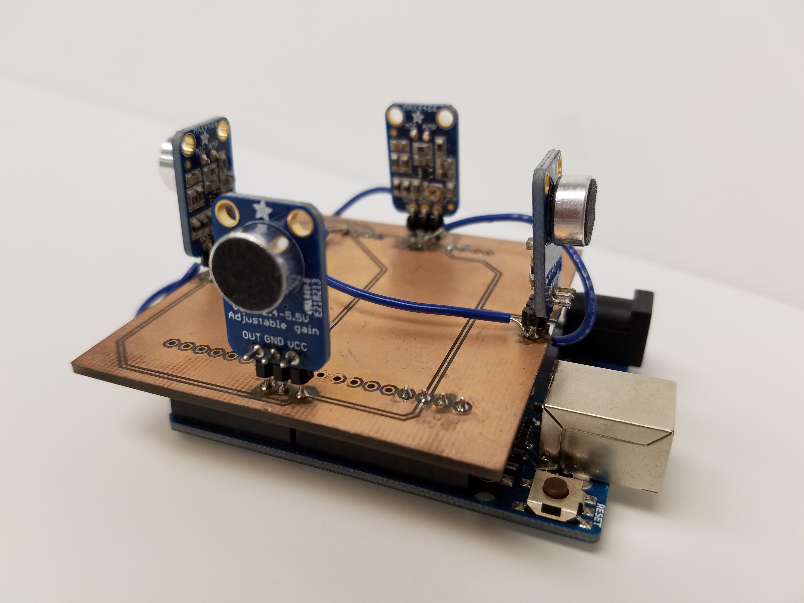

The Smart Campus Energy Lab is led by Dr. Anthony Kuh, a professor of Electrical Engineering at the University of Hawaii at Manoa.

The objective of this project is to design and develop low-cost, accurate, and reliable environmental sensor modules that can easily be reproduced for mass deployment on rooftops across the University of Hawaii at Manoa campus. The meteorological data collected from these modules will assist in planning future renewable energy installations as well as providing risk mitigation for electricity generation through the development of renewable resource prediction and forecasting algorithms.

More information about this project can be found on the wiki page [here](https://wiki.scel-hawaii.org/doku.php?id=introduction).
